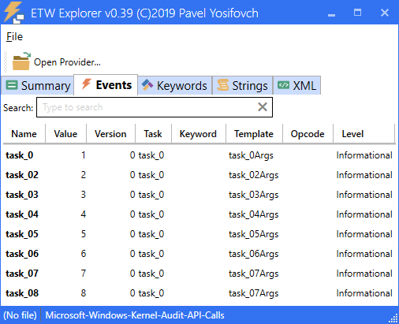

# API-To-ETW

A ghidra script to find all ETW write metadata for each API in a PE file, including any associated public symbols.

## Why?
Many ETW events are extremely useful for cyber security, but are not documented. :-(

Previously, if you're lucky, Matt would do some reversing and [tweet](https://twitter.com/mattifestation/status/1140655593318993920) about them.

Now you can run my ghidra script on ntoskrnl.exe and grep the results...

| Function | Provider Guid | EVENT_DESCRIPTOR Symbol | Id | Version | Channel | Level | Opcode | Task | Keyword |
|--- |--- |--- |--- |--- |--- |--- |--- |--- |--- |
| NtSetSystemInformation | e02a841c&#8209;75a3&#8209;4fa7&#8209;afc8&#8209;ae09cf9b7f23 | KERNEL_AUDIT_API_PSSETLOADIMAGENOTIFYROUTINE | 1 | 0 | 0 | 4 | 0 | 0 | 0x0 |
| NtTerminateProcess | e02a841c-75a3-4fa7-afc8-ae09cf9b7f23 | KERNEL_AUDIT_API_TERMINATEPROCESS | 2 | 0 | 0 | 4 | 0 | 0 | 0x0 |
| NtCreateSymbolicLinkObject | e02a841c-75a3-4fa7-afc8-ae09cf9b7f23 | KERNEL_AUDIT_API_CREATESYMBOLICLINKOBJECT | 3 | 0 | 0 | 4 | 0 | 0 | 0x0 |
| NtSetContextThread | e02a841c-75a3-4fa7-afc8-ae09cf9b7f23 | KERNEL_AUDIT_API_SETCONTEXTTHREAD | 4 | 0 | 0 | 4 | 0| 0 | 0x0 |
| NtOpenProcess | e02a841c-75a3-4fa7-afc8-ae09cf9b7f23 | KERNEL_AUDIT_API_OPENPROCESS | 5 | 0 | 0 | 4 | 0 | 0 | 0x0 |
| NtAlpcOpenSenderProcess | e02a841c-75a3-4fa7-afc8-ae09cf9b7f23 | KERNEL_AUDIT_API_OPENPROCESS | 5 | 0 | 0 | 4 | 0 | 0 | 0x0 |
| NtSetSystemInformation | e02a841c-75a3-4fa7-afc8-ae09cf9b7f23 | KERNEL_AUDIT_API_OPENPROCESS | 5 | 0 | 0 | 4 | 0 | 0 | 0x0 |
| NtOpenThread | e02a841c-75a3-4fa7-afc8-ae09cf9b7f23 | KERNEL_AUDIT_API_OPENTHREAD | 6 | 0 | 0 | 4 | 0 | 0 | 0x0 |
| NtAlpcOpenSenderThread | e02a841c-75a3-4fa7-afc8-ae09cf9b7f23 | KERNEL_AUDIT_API_OPENTHREAD | 6 | 0 | 0 | 4 | 0 | 0 | 0x0 |

:TODO: events 7 & 8 are missing. But this grep was only on a run for syscalls (not all exports) - so missed the kernel APIs like IoRegister.

## Sample Output
 * [syscalls in ntoskrnl.exe](ntoskrnl.exe.csv) (maxEvents=10 maxCallDepth=7 maxExportCallDepth=1)
   * a full dump of all ETW events is much, much longer

## How good is it?
The quality of the output depends on the quality of the decompilation. With the help of public symbols, ghidra is pretty good out of the box for Windows binaries. But if you're not getting the results you want, some manual reversing might help. 

Sometimes you'll encounter a novel design pattern not supported by the script. For example, lsasrv.dll stores provider handles in [a generic table using Adelson-Velsky/Landis (AVL) trees](https://docs.microsoft.com/en-us/windows-hardware/drivers/ddi/ntddk/nf-ntddk-rtlinitializegenerictableavl). So, in order to automatically extract the provider guids, the script needs to understand the GenericTableAvl APIs... 

I'm still missing support for some event write edge cases, but I've tried to flag these in the script output.

## TODO
 * handle classic provider registration - especially WPP
 * improve handling of TraceLogging providers
 * add more sample outputs - e.g. lsasrv.dll, samsrv.dll, win32k.sys
 * handle classic events - [TraceEvent](https://docs.microsoft.com/en-us/windows/win32/api/evntrace/nf-evntrace-traceevent) etc
 * handle edges cases - EVENT_DESCRIPTOR local variable (16 bytes / XMM instructions)
 * handle edge case - wrapper functions without a simple 1:1 parameter mapping
 * improve [INDIRECT](https://ghidra.re/courses/languages/html/additionalpcode.html) pcode handling? - aka ghidra's "data-flow algorithms do not have enough information to follow the data-flow directly" :-/
 * does EtwWriteUMSecurityEvent need special handling?
 * ghidra headless automation?
 
## References
 * https://www.riverloopsecurity.com/blog/2019/05/pcode/
 * [ghidra_scripts](https://github.com/NationalSecurityAgency/ghidra/blob/master/Ghidra/Features/Decompiler/ghidra_scripts/)
 * [ghidra_docs](https://ghidra.re/ghidra_docs/api/)
 
## Inspiration
 * https://github.com/hunters-forge/API-To-Event
 * [How do I detect technique X in Windows?](https://drive.google.com/file/d/19AhMG0ZCOt0IVsPZgn4JalkdcUOGq4DK/view), DerbyCon 2019
 * https://pathtofile.run/codereview/re/python/2020/01/11/ghidra.html
 * https://blog.xpnsec.com/analysing-rpc-with-ghidra-neo4j/
 
## Related Work
 * https://github.com/jdu2600/Windows10EtwEvents
 * https://github.com/airbus-cert/etwbreaker - an IDA plugin